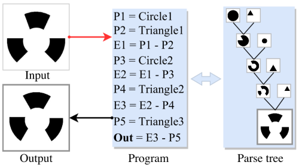

# CSGNet: Neural Shape Parser for Constructive Solid Geometry
[Gopal Sharma](https://hippogriff.github.io/), Rishabh Goyal, Difan Liu, [Evangelos Kalogerakis](https://people.cs.umass.edu/~kalo/), [Subhransu Maji](https://people.cs.umass.edu/~smaji/)

***




_We present a neural architecture that takes as input a 2D or 3D shape and induces a program to generate it. The instructions in our program are based on constructive solid geometry principles, i.e., a set of boolean operations on shape primitives defined recursively. Bottom-up techniques for this task that rely on primitive detection are inherently slow since the search space over possible primitive combinations is large. In contrast, our model uses a recurrent neural network conditioned on the input shape to produce a sequence of instructions in a top-down manner and is significantly faster. It is also more effective as a shape detector than existing state-of-the-art detection techniques. We also demonstrate that our network can be trained on novel dataset without ground-truth program annotations through policy gradient techniques._

[Paper](https://arxiv.org/abs/1712.08290),  [Code-2D](https://github.com/Hippogriff/CSGNet),  [Code-3D](https://github.com/Hippogriff/3DCSGNet)


### Cite:
```bibtex
@InProceedings{Sharma_2018_CVPR,
author = {Sharma, Gopal and Goyal, Rishabh and Liu, Difan and Kalogerakis, Evangelos and Maji, Subhransu},
title = {CSGNet: Neural Shape Parser for Constructive Solid Geometry},
booktitle = {The IEEE Conference on Computer Vision and Pattern Recognition (CVPR)},
month = {June},
year = {2018}
}
```
